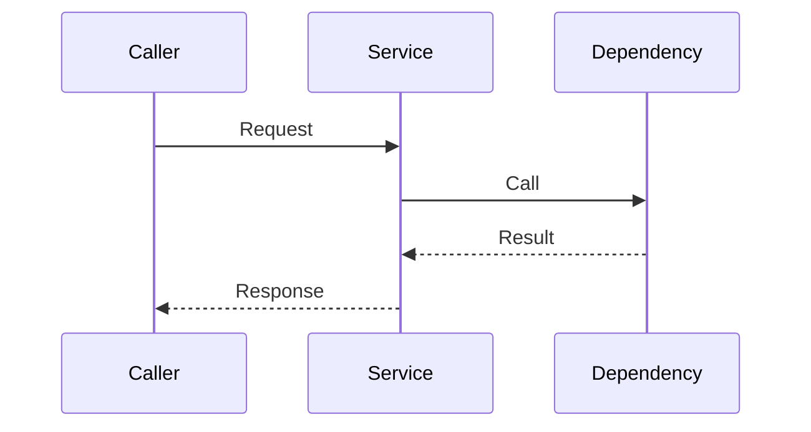

<h1><strong><center>{{feature_title}} - 架构设计说明书</center></strong></h1>
<h1><strong><center>Architecture Design Specification</center></strong></h1>

> Owner: `ta`。本文件负责定义架构设计、技术边界、关键决策和接口契约；不写 task ACL、执行命令或实现代码。

---

**修订记录**

| 日期 | 修订版本 | 修改描述 |
| ---- | -------- | -------- |
|      |          | 初始创建 |

---

[TOC]

---

**Keywords 关键词**：

- 中文：
- 英文：

**Abstract 摘要**：

- 中文：
- 英文：

**术语和缩略语清单**：

| Abbreviations 缩略语 | Full spelling 英文全名 | Chinese explanation 中文解释 |
| -------------------- | ---------------------- | ---------------------------- |
|                      |                        |                              |

---

# 1 简介

## 1.1 目的

> [!NOTE]
> 说明本架构设计希望达成的目标，以及它如何支撑 proposal 和 stories。

-

## 1.2 范围

### 1.2.1 范围内

-

### 1.2.2 非目标

-

## 1.3 支撑场景

| 场景/Story | 用户价值 | 架构关注点 | 关联AC |
| ---------- | -------- | ---------- | ------ |
| {{story_id}} | {{value}} |  | `AC-1` |

## 1.4 对已有架构的借鉴和反思（可选）

- 已有可复用设计：
- 已有问题或债务：
- 本次沿用/调整原因：

# 2 架构目标和关键质量属性

## 2.1 架构目标

> [!NOTE]
> 描述架构设计要保证什么，不重复 proposal 的业务目标。

-

## 2.2 关键DFX指标

| 架构五维能力 | 序号 | DFX属性 | 满足方式 |
| ------------ | ---- | ------- | -------- |
| 功能 | 0 | 功能完整性 |  |
| 开发与演进类属性 | 1 | 可构建性 |  |
| 开发与演进类属性 | 2 | 可演进性 |  |
| 开发与演进类属性 | 3 | 可测试性 |  |
| 开发与演进类属性 | 4 | 可重用性 |  |
| 开发与演进类属性 | 5 | 易学习性 |  |
| 生态系统类属性 | 6 | 开放性 |  |
| 生态系统类属性 | 7 | 可定制性 |  |
| 生态系统类属性 | 8 | 易集成性 |  |
| 生态系统类属性 | 9 | 兼容性 |  |
| 交付类属性 | 10-11 | 可供应性/可制造性 |  |
| 交付类属性 | 12 | 可部署性 |  |
| 运行类属性 | 13 | 可靠性 |  |
| 运行类属性 | 14 | 安全性 |  |
| 运行类属性 | 15 | 可服务性 |  |
| 运行类属性 | 16 | 性能 |  |
| 运行类属性 | 17-18 | 可伸缩性/可扩展性 |  |
| 运行类属性 | 19 | 节能减排 |  |
| 运行类属性 | 20 | 易用性 |  |

## 2.3 关键架构需求

| 需求类别 | 原始需求 | 需求版本/来源 | 需求概述 | 关联Story/AC |
| -------- | -------- | ------------- | -------- | ------------ |
|          |          |               |          |              |

# 3 架构原则

## 3.1 设计原则

> [!NOTE]
> 结合系统架构设计目标选择本 feature 必须遵循的原则，并说明满足方式。

| 序号 | 原则 | 满足方式 | 解释 |
| ---- | ---- | -------- | ---- |
| 1 | 全面解耦原则 |  | 对业务、数据、逻辑、软硬件、平台和产品边界进行解耦 |
| 2 | 服务化/组件化原则 |  | 以服务、数据为中心，支持灵活组合 |
| 3 | 接口隔离及服务自治原则 |  | 通过接口隐藏实现细节，契约化、标准化、兼容演进 |
| 4 | 弹性伸缩原则 |  | 支撑高性能、高吞吐、高并发、高可用场景 |
| 5 | 安全可靠环保原则 |  | 最小权限、纵深防御、可靠性和资源效率 |
| 6 | 用户体验和自动化运维原则 |  | 支持远程、自动、智能、安全、高效运维 |
| 7 | 开放生态原则 |  | 按需开放平台、中间件、数据、业务逻辑或 UI 能力 |
| 8 | 高效开发原则 |  | 支持迭代、增量、持续交付和独立验证 |
| 9 | 柔性供应制造原则 |  | 模块化、标准化、平台化和可供应 |
| 10 | 持续演进原则 |  | 管理架构需求，及时重构并适配变化 |

## 3.2 假设和约束

### 3.2.1 假设

-

### 3.2.2 约束

-

# 4 用例视图

## 4.1 上下文模型

> [!NOTE]
> 描述系统边界、外部用户、外部系统和上下游依赖。

```mermaid
flowchart LR
  Actor[Actor] --> System[{{feature_title}}]
  System --> External[External System]
```

### 4.1.1 外部接口描述

| 提供方 | 接口 | 用途 | 约束 |
| ------ | ---- | ---- | ---- |
|        |      |      |      |

## 4.2 关键用例模型

> [!NOTE]
> 引用 proposal/stories 中被标记为架构关键的用例。

-

### 4.2.1 交互场景

- 正常场景：
- 异常场景：
- 运维/恢复场景：

# 5 关键方案设计

## 5.1 架构模式（可选）

- 采用模式：
- 适用原因：
- 不采用的替代方案：

## 5.2 关键方案

> [!NOTE]
> 每条决策建议写清选择、原因、影响和替代方案，便于 DEV 与 QA 追踪。

| ID | 决策 | 原因 | 影响 | 替代方案 |
|----|------|------|------|----------|
| AD-001 |  |  |  |  |

# 6 逻辑视图

## 6.1 逻辑模型

### 6.1.1 0层逻辑架构

-

### 6.1.2 1层逻辑架构

-

### 6.1.3 n层逻辑架构

-

### 6.1.4 接口设计

| 提供模块 | 接口 | 用途 | 约束 |
| -------- | ---- | ---- | ---- |
|          |      |      |      |

## 6.2 逻辑视图元素清单

| 逻辑元素 | 职责 | Owner | 备注 |
| -------- | ---- | ----- | ---- |
|          |      |       |      |

## 6.3 技术模型

### 6.3.1 技术选型

| 选型项 | 选择 | 原因 | 约束/风险 |
| ------ | ---- | ---- | --------- |
| 开发语言 |  |  |  |
| 框架/库 |  |  |  |
| 中间件 |  |  |  |

## 6.4 数据模型

### 6.4.1 关键数据设计

-

### 6.4.2 静态数据结构模型

-

### 6.4.3 数据所有权模型

| 数据 | Owner | 写入方 | 读取方 | 生命周期 |
| ---- | ----- | ------ | ------ | -------- |
|      |       |        |        |          |

### 6.4.4 安全/隐私数据模型

| 数据 | 敏感级别 | 存储/传输保护 | 访问约束 |
| ---- | -------- | ------------- | -------- |
|      |          |               |          |

## 6.5 安全/韧性逻辑模型

### 6.5.1 价值资产清单/列表

-

### 6.5.2 暴露面清单/列表

-

### 6.5.3 攻击路径模型

-

### 6.5.4 韧性控制点清单/列表

-

### 6.5.5 安全韧性威胁模型

-

### 6.5.6 安全韧性逻辑模型

-

# 7 开发视图

## 7.1 代码模型

> [!NOTE]
> 说明逻辑元素如何映射到代码元素。这里描述边界和契约，不拆 task。

### 7.1.1 代码元素清单

| 逻辑元素 | 代码元素 | 说明 |
| -------- | -------- | ---- |
|          |          |      |

## 7.2 构建模型

### 7.2.1 构建元素清单

| 构建元素 | 构建过程/工具链 | 代码元素 |
| -------- | --------------- | -------- |
|          |                 |          |

# 8 部署视图

## 8.1 交付模型

### 8.1.1 交付元素清单

| 交付元素 | 打包过程 | 构建元素 |
| -------- | -------- | -------- |
|          |          |          |

### 8.1.2 软件包命名格式

-

## 8.2 部署模型

- 部署形态：
- 网络分区：
- 依赖服务：
- 升级/回退：

# 9 运行视图

## 9.1 运行模型



## 9.2 并发/失败/恢复模型

- 并发控制：
- 失败处理：
- 恢复策略：
- 可观测性：

# 10 风险与验证影响

> [!NOTE]
> 说明哪些风险需要 DEV 在 `tasks.md` 中覆盖，哪些需要 QA 在 `validation-report.md` 中审计。

| 风险ID | 风险 | 影响 | 需要DEV覆盖 | 需要QA审计 |
| ------ | ---- | ---- | ----------- | ---------- |
| AR-001 |      |      |             |            |

# 11 其他说明

-

# 12 参考资料

| 资料 | 链接/位置 | 说明 |
| ---- | --------- | ---- |
|      |           |      |
