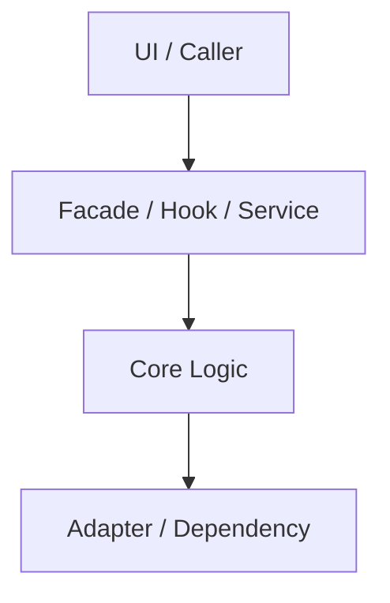
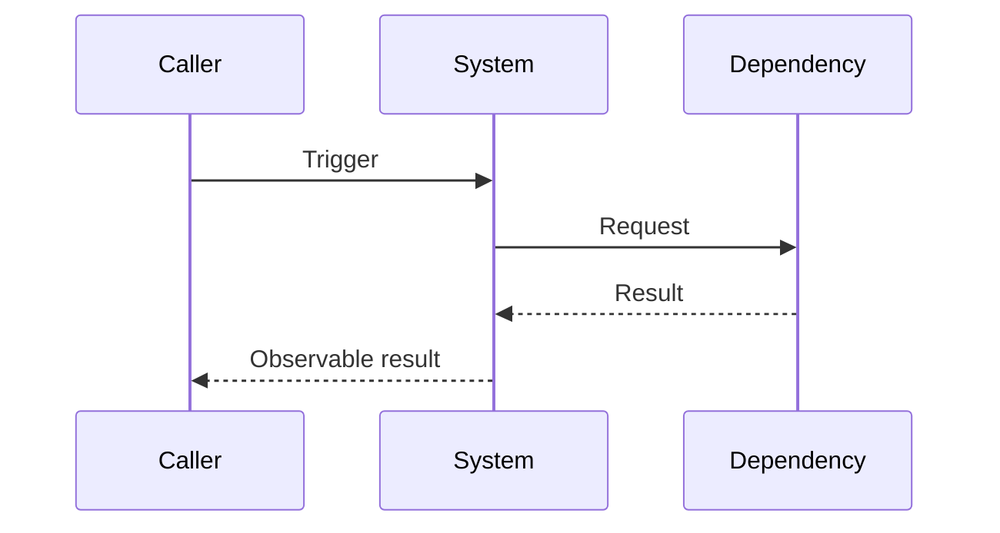

<h1><strong><center>{{feature_title}} - 架构设计说明书</center></strong></h1>
<h1><strong><center>Architecture Design Specification</center></strong></h1>

> Owner: `ta`。本文件定义架构设计、技术边界、关键决策和接口契约；不写 task ACL、执行命令或实现代码。
>
> 存量回填时必须基于当前代码和测试重建架构事实。若原文档与代码冲突，以代码事实为准，并在“差异与迁移”中记录。

---

**修订记录**

| 日期 | 修订版本 | 修改描述 | 证据来源 |
| ---- | -------- | -------- | -------- |
|      | 0.1 | 初始创建/回填 | proposal、stories、代码、测试 |

---

[TOC]

---

## 写作完成标准

- 只在 `stories.md` 标记 `architecture_needed: true` 时创建或重构本文件。
- 每个架构决策必须包含原因、影响、替代方案和验证影响。
- 4+1 视图必须写真实模块、真实代码路径、真实运行链路；不要保留空表。
- 无部署/安全/数据等内容时写“不涉及：原因”，不要空着。
- 可参考 `skills/quick-sdd/templates/golden-samples/architecture-4plus1.golden.md`。

**Keywords 关键词**：

- 中文：
- 英文：

**Abstract 摘要**：

- 中文：
- 英文：

**术语和缩略语清单**：

| 术语 | 英文/代码名 | 中文解释 | 来源 |
| ---- | ----------- | -------- | ---- |
|      |             |          |      |

---

# 1 简介

## 1.1 目的

- 支撑的 proposal：
- 支撑的 stories/AC：
- 本架构文档要澄清的技术问题：

## 1.2 范围

### 1.2.1 范围内

| 架构对象 | 描述 | 证据来源 |
| -------- | ---- | -------- |
|          |      |          |

### 1.2.2 非目标

| 非目标 | 原因 | 后续承接 |
| ------ | ---- | -------- |
|        |      |          |

## 1.3 当前实现证据

| 类型 | 路径/位置 | 说明 | 可信度 |
| ---- | --------- | ---- | ------ |
| 代码 |  |  | 高 |
| 测试 |  |  | 高/中/低 |
| 历史文档 |  |  | 高/中/低 |
| 运行证据 |  |  | 高/中/低 |

## 1.4 支撑场景

| Story/AC | 用户价值 | 架构关注点 | 是否关键用例 |
| -------- | -------- | ---------- | ------------ |
| {{story_id}} / `AC-1` | {{value}} |  | 是/否 |

# 2 架构目标和关键质量属性

## 2.1 架构目标

| 目标ID | 目标 | 关联 Story/AC | 验证方式 |
| ------ | ---- | ------------- | -------- |
| AG-001 |  | `AC-1` |  |

## 2.2 关键 DFX 指标

| DFX 属性 | 是否涉及 | 满足方式 | 验证影响 |
| -------- | -------- | -------- | -------- |
| 可演进性 | 是 |  |  |
| 可测试性 | 是 |  |  |
| 兼容性 | 否 |  |  |
| 性能 | 否 |  |  |
| 可靠性 | 否 |  |  |
| 安全/隐私 | 否 |  |  |
| 可维护性 | 是 |  |  |

# 3 架构原则与约束

## 3.1 设计原则

| 原则 | 本次满足方式 | 不满足时的风险 |
| ---- | ------------ | -------------- |
| 边界清晰 |  |  |
| 契约优先 |  |  |
| 兼容演进 |  |  |
| 可验证 |  |  |

## 3.2 假设和约束

| 类型 | 内容 | 影响 | 证据来源 |
| ---- | ---- | ---- | -------- |
| 假设 |  |  |  |
| 约束 |  |  |  |

# 4 用例视图

## 4.1 上下文模型

```mermaid
flowchart LR
  Actor[Actor] --> System[{{feature_title}}]
  System --> Existing[Existing Capability]
  System --> Dependency[Dependency]
```

## 4.2 关键用例

| 用例 | 主成功场景 | 异常场景 | 架构关注点 | 关联AC |
| ---- | ---------- | -------- | ---------- | ------ |
|      |            |          |            | `AC-1` |

## 4.3 外部接口与依赖

| 方向 | 对象 | 接口/契约 | 用途 | 约束 |
| ---- | ---- | --------- | ---- | ---- |
| 入站 |  |  |  |  |
| 出站 |  |  |  |  |

# 5 关键方案与架构决策

## 5.1 方案概述

- 采用方案：
- 不采用方案：
- 核心权衡：

## 5.2 架构决策

| ID | 决策 | 原因 | 影响 | 替代方案 | 验证影响 |
|----|------|------|------|----------|----------|
| AD-001 |  |  |  |  |  |

# 6 逻辑视图

## 6.1 逻辑模型



## 6.2 逻辑元素清单

| 逻辑元素 | 职责 | 输入 | 输出 | Owner |
| -------- | ---- | ---- | ---- | ----- |
|          |      |      |      |       |

## 6.3 接口设计

| 提供模块 | 接口/类型 | 用途 | 兼容策略 | 关联 AD |
| -------- | --------- | ---- | -------- | ------- |
|          |           |      |          | `AD-001` |

## 6.4 数据模型

| 数据/状态 | Owner | 写入方 | 读取方 | 生命周期 | 约束 |
| --------- | ----- | ------ | ------ | -------- | ---- |
|           |       |        |        |          |      |

## 6.5 安全、韧性与边界

| 关注点 | 是否涉及 | 控制点 | 验证方式 |
| ------ | -------- | ------ | -------- |
| 权限/角色 | 否 |  |  |
| 不可信输入 | 否 |  |  |
| 失败降级 | 否 |  |  |
| 可观测性 | 是 |  |  |

# 7 开发视图

## 7.1 代码映射

| 逻辑元素 | 代码路径 | 公开出口 | 测试路径 |
| -------- | -------- | -------- | -------- |
|          |          |          |          |

## 7.2 构建与包边界

| 构建元素 | 构建过程/工具链 | 产物 | 备注 |
| -------- | --------------- | ---- | ---- |
|          |                 |      |      |

## 7.3 依赖与导入边界

| 依赖 | 使用位置 | 引入原因 | 替代方案/风险 |
| ---- | -------- | -------- | ------------- |
|      |          |          |               |

# 8 部署视图

## 8.1 交付形态

| 交付元素 | 打包方式 | 消费方 | 兼容要求 |
| -------- | -------- | ------ | -------- |
|          |          |        |          |

## 8.2 部署/运行环境

- 部署形态：
- 网络分区：
- 依赖服务：
- 配置项：
- 升级/回退：

# 9 运行视图

## 9.1 主流程



## 9.2 状态、并发与失败恢复

| 场景 | 处理策略 | 用户/调用方可见结果 | 验证方式 |
| ---- | -------- | ------------------- | -------- |
| 正常 |  |  |  |
| 异常 |  |  |  |
| 并发 |  |  |  |
| 恢复/回滚 |  |  |  |

# 10 差异、迁移与兼容

| 对象 | 原文档/旧行为 | 当前代码事实/新行为 | 处理策略 |
| ---- | ------------- | ------------------- | -------- |
|      |               |                     | 保留/迁移/废弃 |

# 11 风险与验证影响

| 风险ID | 风险 | 影响 | 需要 DEV 覆盖 | 需要 QA 审计 |
| ------ | ---- | ---- | ------------- | ------------ |
| AR-001 |      |      |               |              |

## 11.1 验证建议

| 验证项 | 覆盖 AC/AD | 建议方式 | 证据位置 |
| ------ | ---------- | -------- | -------- |
|        | `AC-1` / `AD-001` | 单元/组件/集成/视觉/人工 |  |

# 12 参考资料

| 资料 | 链接/位置 | 说明 |
| ---- | --------- | ---- |
|      |           |      |
