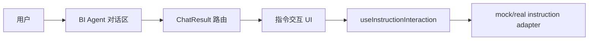
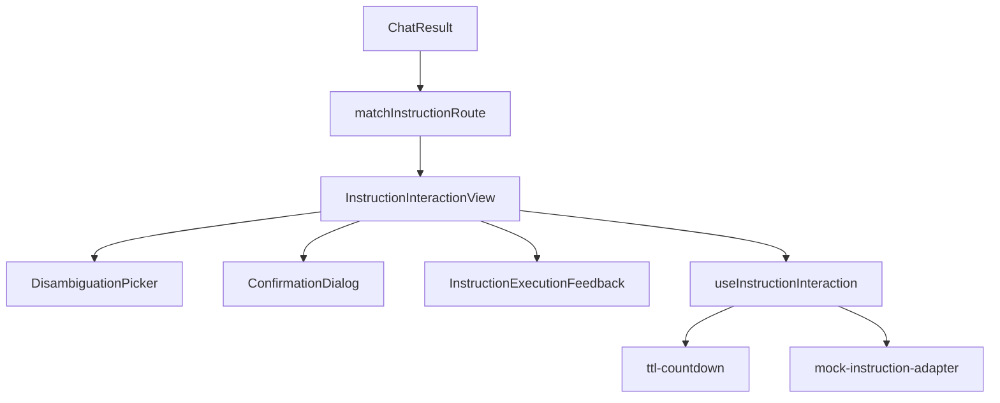
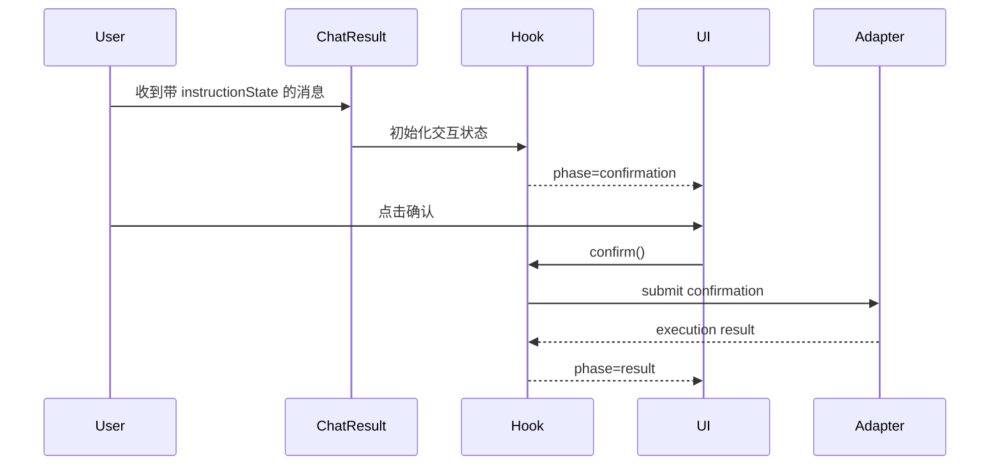

# 4+1 架构视图黄金样例

> 本样例展示 architecture 模板的填写密度和证据写法。它不是新规格，不参与 quick-sdd 流程；编写存量回填文档时，可按本样例的粒度组织真实代码路径、接口、状态和验证证据。

## 1 简介

### 目的

- 定义 BI Agent 指令交互闭环的前端架构边界。
- 支撑“歧义消解、危险操作确认、执行反馈、自动回滚”相关 stories。
- 让 DEV 和 QA 能基于同一组状态机、组件边界和路由优先级验证行为。

### 当前实现证据

| 类型 | 路径/位置 | 说明 | 可信度 |
| ---- | --------- | ---- | ------ |
| 代码 | `apps/bi-playground/src/pages/dte-bi-agent-mock-data.ts` | mock 数据与 ChatResult 交互样例 | 高 |
| 代码 | `packages/bi-designer/src/locale/` | 指令交互文案扩展位置示例 | 中 |
| 历史文档 | `codespec/specs/FEAT-121-BI-Agent指令交互闭环/architecture.md` | 原始 4+1 视图来源 | 高 |
| 测试 | `packages/**/__tests__`、`apps/**/__tests__` | 实际重构时填入精确测试路径 | 待确认 |

## 2 架构目标和关键质量属性

| 目标ID | 目标 | 关联 Story/AC | 验证方式 |
| ------ | ---- | ------------- | -------- |
| AG-001 | 指令交互 UI 与 ChatResult 路由解耦，新增优先级不得影响 P1-P11 既有渲染 | ST-001 / AC-1 | 组件测试 + 路由匹配测试 |
| AG-002 | 指令状态由 hook 统一管理，展示组件保持纯展示 | ST-006 / AC-2 | hook 单元测试 + props 快照 |
| AG-003 | TTL、rollback、失败展示具备可重复验证路径 | ST-003 / AC-3 | 纯函数单元测试 + 异常场景测试 |

## 3 架构原则与约束

| 原则 | 本次满足方式 | 不满足时的风险 |
| ---- | ------------ | -------------- |
| 边界清晰 | `useInstructionInteraction` 管状态，展示组件只消费 props | UI 状态散落，QA 难以构造边界场景 |
| 契约优先 | ChatResult 通过 `instructionState` 可选 prop 接入 | 路由优先级互相踩踏 |
| 可验证 | TTL 倒计时拆为纯函数 | 时间相关场景只能人工验证 |

## 4 用例视图

### 4.1 上下文模型

### 4.2 关键用例

| 用例 | 主成功场景 | 异常场景 | 架构关注点 | 关联AC |
| ---- | ---------- | -------- | ---------- | ------ |
| 歧义消解 | 用户选择候选对象后继续执行指令 | 候选为空或过期时展示失败状态 | 状态机 phase 与展示组件解耦 | `AC-1` |
| 危险操作确认 | 用户在 TTL 内确认，runtime 继续执行 | TTL 过期后禁止确认 | TTL 纯函数、倒计时渲染、过期保护 | `AC-2` |
| 自动回滚 | 执行失败后展示 rollback 结果 | rollback 失败时展示通用失败 | 不新增独立弹窗，复用反馈组件 | `AC-3` |

## 5 关键方案与架构决策

| ID | 决策 | 原因 | 影响 | 替代方案 | 验证影响 |
|----|------|------|------|----------|----------|
| AD-001 | 指令交互状态集中在 `useInstructionInteraction` | 降低 ChatResult 和展示组件耦合 | 所有展示组件通过同一状态模型驱动 | 各组件自行维护状态 | hook 测试覆盖 phase 转换 |
| AD-002 | ChatResult 新增低优先级 P12-P14 路由 | 不破坏 P1-P11 既有渲染 | 指令 UI 只在其他结果不匹配时渲染 | 插入高优先级路由 | 路由测试覆盖优先级 |
| AD-003 | rollback askUser 自动进入结果反馈 | 减少交互分支和弹窗数量 | 不新增 RollbackChoiceDialog | 新增独立回滚选择弹窗 | 异常场景测试覆盖 |

## 6 逻辑视图

### 6.1 逻辑模型

### 6.2 逻辑元素清单

| 逻辑元素 | 职责 | 输入 | 输出 | Owner |
| -------- | ---- | ---- | ---- | ----- |
| `matchInstructionRoute` | 判断 ChatResult 是否进入指令交互渲染 | message、instructionState | route result | Copilot UI |
| `useInstructionInteraction` | 管理 idle/disambiguation/confirmation/result phase | plan、user action、timer | state、actions | Copilot UI |
| `ttl-countdown` | 计算剩余时间和过期状态 | expiresAt、now | remaining、expired | Shared util |
| 展示组件 | 展示候选、确认、反馈 | props | UI event | UI primitives |

### 6.3 接口设计

| 提供模块 | 接口/类型 | 用途 | 兼容策略 | 关联 AD |
| -------- | --------- | ---- | -------- | ------- |
| ChatResult | `instructionState?: InstructionInteractionState` | 注入指令交互状态 | 可选 prop，不影响既有调用 | `AD-002` |
| Hook | `useInstructionInteraction(plan, options)` | 输出 phase 与 actions | 新增 hook，不改 runtime | `AD-001` |
| TTL util | `getRemainingTtl(expiresAt, now)` | 纯函数倒计时 | 无副作用，可单测 | `AD-003` |

## 7 开发视图

| 逻辑元素 | 代码路径 | 公开出口 | 测试路径 |
| -------- | -------- | -------- | -------- |
| ChatResult 路由 | `packages/bi-designer/src/.../ChatResult.tsx` | React component | `*.test.tsx` |
| 交互 hook | `packages/bi-designer/src/.../useInstructionInteraction.ts` | named export | `useInstructionInteraction.test.ts` |
| TTL util | `packages/bi-designer/src/.../ttl-countdown.ts` | named export | `ttl-countdown.test.ts` |
| mock adapter | `apps/bi-playground/src/.../mock-instruction-adapter.ts` | playground only | playground smoke |

> 回填真实 FEAT 时，上表必须替换为仓库中的精确路径；不存在的路径不能保留。

## 8 部署视图

| 交付元素 | 打包方式 | 消费方 | 兼容要求 |
| -------- | -------- | ------ | -------- |
| `@bi/designer` 前端包 | workspace package build | Playground、业务前端 | 可选 prop 兼容旧调用 |
| Playground mock 场景 | Vite app | 开发验证 | 不进入生产链路 |

## 9 运行视图

### 9.1 主流程

### 9.2 状态、并发与失败恢复

| 场景 | 处理策略 | 用户/调用方可见结果 | 验证方式 |
| ---- | -------- | ------------------- | -------- |
| TTL 过期 | hook 拒绝确认动作 | 确认按钮禁用或展示过期提示 | TTL 单测 + 组件测试 |
| rollback 成功 | 自动展示 rollbackExecuted 结果 | 反馈卡片显示已回滚 | hook 状态转换测试 |
| adapter 失败 | 进入通用失败反馈 | 用户看到失败原因和可重试提示 | 异常 mock 测试 |

## 10 差异、迁移与兼容

| 对象 | 原文档/旧行为 | 当前代码事实/新行为 | 处理策略 |
| ---- | ------------- | ------------------- | -------- |
| ChatResult 路由 | 仅覆盖常规报告/表单/推荐结果 | 新增指令交互低优先级路由 | 保留旧优先级，补测试 |
| rollback 交互 | 曾考虑独立选择弹窗 | 采用自动回滚反馈 | 记录为架构决策 |

## 11 风险与验证影响

| 风险ID | 风险 | 影响 | 需要 DEV 覆盖 | 需要 QA 审计 |
| ------ | ---- | ---- | ------------- | ------------ |
| AR-001 | 路由优先级插入错误 | 既有 ChatResult 渲染回归 | 路由匹配测试 | P1-P11 不回归 |
| AR-002 | 时间相关逻辑不可重复 | TTL 测试不稳定 | 纯函数注入 now | 固定时间用例 |
