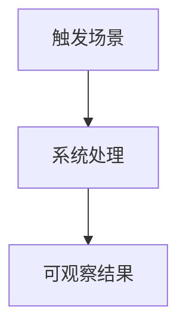

<h1><strong>
{{feature_title}} - 需求分析说明书
</strong></h1>

> Owner: `ra`。本文件定义问题、目标、范围、约束、风险和需求分析结论；不写实现任务、ACL 或执行命令。
>
> 回填存量规格时，本文件必须基于“原始文档 + 当前代码 + 测试/运行证据”重建，不允许凭空补写需求意图。无法确认的内容写入“待确认问题”。

---

**修订记录**

| 日期 | 修订版本 | 修改描述 | 证据来源 |
| ---- | -------- | -------- | -------- |
|      | 0.1 | 初始创建/回填 | 原文档、代码、测试 |

---

[TOC]

---

## 写作完成标准

- 每个关键结论必须能回到“原始需求、历史规格、代码路径、测试路径、运行截图/日志、人工确认”之一。
- 新建规格写“期望能力”；存量回填写“当前真实能力 + 与原规格差异”。
- 小改动规格可保留轻量化内容，但必须说明为什么不需要独立架构设计。
- 如果本 FEAT 被其他 FEAT 合并或吸收，在“规格合并与裁剪建议”中写明主规格和保留的追溯关系。

**Keywords 关键词**：

- 中文：
- 英文：

**Abstract 摘要**：

- 中文：
- 英文：

**术语和缩略语清单**：

| 术语 | 英文/代码名 | 中文解释 | 来源 |
| ---- | ----------- | -------- | ---- |
|      |             |          |      |

---

# 1 背景与问题

## 1.1 原始输入

> [!NOTE]
> 保留用户请求、历史 proposal、issue、PR、产品说明或口头结论的原始来源。不要在本节写实现方案。

| 来源 | 位置/链接 | 原文摘要 | 可信度 | 备注 |
| ---- | --------- | -------- | ------ | ---- |
| 历史规格 | `./proposal.md` |  | 高/中/低 |  |
| 代码现状 |  |  | 高 |  |
| 测试现状 |  |  | 高/中/低 |  |

## 1.2 当前问题

- 用户/业务问题：
- 工程问题：
- 文档与代码不一致点：
- 本次重构或新增规格要解决的边界：

## 1.3 目标用户与使用场景

| 用户/角色 | 使用场景 | 关键诉求 | 失败影响 |
| --------- | -------- | -------- | -------- |
| {{actor}} |          | {{value}} |          |

# 2 范围

## 2.1 范围内

| 能力/对象 | 描述 | 证据来源 | 是否已实现 | 备注 |
| --------- | ---- | -------- | ---------- | ---- |
| {{capability}} |  |  | 是/否/部分 |  |

## 2.2 范围外

| 不做事项 | 原因 | 后续承接 |
| -------- | ---- | -------- |
|          |      |          |

## 2.3 假设与约束

| 类型 | 描述 | 影响 | 是否可变 | 证据来源 |
| ---- | ---- | ---- | -------- | -------- |
| 技术约束 |  |  | 是/否 |  |
| 兼容约束 |  |  | 是/否 |  |
| 交付约束 |  |  | 是/否 |  |

# 3 当前实现盘点（存量回填必填）

> [!NOTE]
> 如果是新需求，本章写“不涉及，待实现”。如果是重构存量规格，必须从当前代码反推真实能力。

## 3.1 代码路径

| 代码路径 | 职责 | 与本 FEAT 的关系 | 备注 |
| -------- | ---- | ---------------- | ---- |
|          |      |                  |      |

## 3.2 测试与验证路径

| 测试/验证路径 | 覆盖能力 | 当前结果 | 缺口 |
| ------------- | -------- | -------- | ---- |
|               |          |          |      |

## 3.3 已有文档与差异

| 文档 | 现状摘要 | 与代码差异 | 处理方式 |
| ---- | -------- | ---------- | -------- |
|      |          |            | 保留/重写/并入/归档 |

# 4 需求分析

## 4.1 5W2H

| 维度 | 内容 |
| ---- | ---- |
| Who | {{actor}} |
| When |  |
| Why | {{value}} |
| Where |  |
| What | {{capability}} |
| How | 只描述用户可感知流程，不写代码任务 |
| HowMuch | 数量、规模、性能、兼容或体验指标 |

## 4.2 需求分解

| SR ID | 需求名称 | 需求描述 | 来源 | 优先级 | 后续 Story |
| ----- | -------- | -------- | ---- | ------ | ---------- |
| SR-001 |  |  |  | {{priority}} | {{story_id}} |

## 4.3 关键用例

### 4.3.1 用例信息

- **Actor**：
- **前置条件**：
- **触发事件**：
- **主成功场景**：
- **扩展/异常场景**：
- **最小保证**：
- **成功保证**：
- **是否架构关键用例**：是/否

### 4.3.2 场景流程

# 5 非功能需求与 DFX

> [!NOTE]
> 只写本 FEAT 涉及的 DFX。不涉及时写“不涉及：原因”，不要保留空表。

| DFX 类别 | 是否涉及 | 指标/约束 | 验证提示 | 证据来源 |
| -------- | -------- | --------- | -------- | -------- |
| 性能 | 否 |  |  |  |
| 可靠性/可用性 | 否 |  |  |  |
| 安全/隐私 | 否 |  |  |  |
| 兼容性 | 否 |  |  |  |
| 可测试性 | 是 |  |  |  |
| 可维护性 | 是 |  |  |  |
| 国际化/可访问性 | 否 |  |  |  |

# 6 依赖与影响

| 对象 | 当前状态 | 预期变化 | 风险/约束 | 验证方式 |
| ---- | -------- | -------- | --------- | -------- |
| 上游调用方 |  |  |  |  |
| 下游依赖 |  |  |  |  |
| 数据/协议 |  |  |  |  |
| UI/交互 |  |  |  |  |

# 7 规格合并与裁剪建议

> [!NOTE]
> 用于存量规格治理。新建 FEAT 可写“不涉及”。

| 候选 FEAT/文档 | 关系 | 建议动作 | 主规格 | 保留追溯方式 |
| -------------- | ---- | -------- | ------ | ------------ |
|                | 重复/子能力/历史草稿/无代码证据 | 保留/合并/归档/重写 | {{feature_id}} | README、被合并文档说明、validation 记录 |

# 8 风险与待确认问题

## 8.1 风险

| ID | 风险 | 类型 | 影响 | 缓解方式 | Owner |
| -- | ---- | ---- | ---- | -------- | ----- |
| R-001 |  |  |  |  |  |

## 8.2 待确认问题

| ID | 问题 | 影响 | Owner | 决策期限 | 未决时处理 |
| -- | ---- | ---- | ----- | -------- | ---------- |
| OQ-001 |  |  |  |  | 阻塞/带风险推进 |

# 9 交付给 TA 的判断

## 9.1 Story 拆分建议

| Story | 用户价值 | 验收重点 | 建议优先级 |
| ----- | -------- | -------- | ---------- |
| {{story_id}} | {{value}} |  | {{priority}} |

## 9.2 架构影响信号

| 信号 | 是否命中 | 说明 |
| ---- | -------- | ---- |
| 跨包/跨服务/跨编辑器 | 否 |  |
| 新增或改变公开 API/协议/DSL | 否 |  |
| 新增状态机、异步流程、权限边界 | 否 |  |
| 改变数据模型、持久化、迁移策略 | 否 |  |
| 仅同类小增量或展示调整 | 是/否 |  |

建议结论：`architecture_needed: true/false`，由 TA 在 `stories.md` frontmatter 最终确认。
