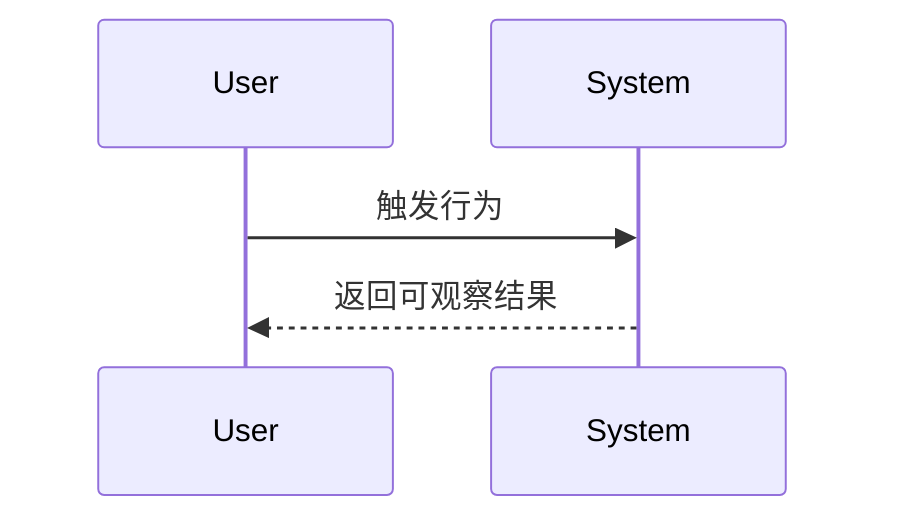

# 用户故事 / Story设计说明书

> Owner: `ta`。Story 文档定义用户可感知价值、验收标准、依赖关系和 story 级设计约束；不要写 task ACL、执行命令或实现任务清单。

---

**修订记录**

| 日期 | 修订版本 | 修改描述 |
| ---- | -------- | -------- |
|      |          | 初始创建 |

---

[TOC]

---

**Keywords 关键词**：

- 中文：
- 英文：

**Abstract 摘要**：

- 中文：
- 英文：

**术语和缩略语清单**：

| Abbreviations 缩略语 | Full spelling 英文全名 | Chinese explanation 中文解释 |
| -------------------- | ---------------------- | ---------------------------- |
|                      |                        |                              |

---

## 索引

| ID | 标题 | 优先级 | 状态 | 依赖 |
|----|------|--------|------|------|
| {{story_id}} | {{story_title}} | {{priority}} | ready | - |

# 1 概述

## 1.1 {{story_id}} {{story_title}}

```yaml
id: {{story_id}}
title: {{story_title}}
priority: {{priority}}
status: ready
depends_on: []
```

### 1.1.1 故事

<!-- 尽量使用标准的 “作为 / 我想要 / 以便” 结构。 -->

- **作为**：{{actor}}
- **我要**：{{capability}}
- **从而**：{{value}}
- **现状**：
- **要求**：
- **需求分析文档参考**：[{{feature_title}} - 需求分析说明书](./proposal.md)
- **架构设计文档参考**：[{{feature_title}} - 架构设计说明书](./architecture.md)

### 1.1.2 验收标准

<!-- 旧模板优秀实践保留：为验收标准分配稳定 ID，并优先使用 Given / When / Then，便于轻量 traceability。 -->

| ID | Given 前置条件 | When 触发行为 | Then 可观察结果 | 验证提示 |
| -- | -------------- | ------------- | --------------- | -------- |
| `AC-1` | ... | ... | ... | ... |
| `AC-2` | ... | ... | ... | ... |

> [!NOTE] 编写要求
> - 每条 AC 只描述一个可验证结果，避免把多个结论塞进同一条。
> - AC 应覆盖正常路径、关键异常路径、权限/边界条件，以及 proposal 中明确要求的 DFX 指标。
> - AC ID 在 `validation-report.md` 中复用，不随文字微调而改号。
> - 验收标准写用户或系统可观察行为，不写“代码已实现”“接口已开发”这类实现动作。

### 1.1.3 架构关联

<!-- 如 story 依赖架构设计，请引用 architecture.md 中的决策 ID。 -->

- `AD-001`

### 1.1.4 范围外

-

# 2 上下文依赖（外部，谁用你，你用谁）

> [!NOTE]
> 使用上下文图表示 story 与外部系统/用户/平台能力的关系。外部依赖可参考下表。

| 方向 | 外部依赖 | 举例/说明 | 备注 |
| ---- | -------- | --------- | ---- |
| 谁用你 | 浏览器/客户端 | ER 接口的使用方一般是浏览器或实际客户发起方 |  |
| 谁用你 | 下游产品服务 | 数据分析平台调用本系统统计接口 |  |
| 谁用你 | 周边产品服务 | 可视化看板与业务数据有交互关系 |  |
| 谁用你 | 北向产品服务 | 外部接口服务调用本系统能力 |  |
| 谁用你 | 定时器 | Cron 任务拉起数据同步等操作 | 所有功能都应有入口 |
| 你用谁 | 外部系统 | 依赖通知服务、安全服务、服务器管理接口等 | 建议精确到服务级别 |
| 你用谁 | 云化底座 | 容器平台、配置注册、服务发现等 |  |
| 你用谁 | 中间件 | 消息队列、配置中心、缓存等 | 新引入必须体现 |
| 你用谁 | 数据库 | 新增数据库实例、表、缓存或持久化存储 |  |
| 你用谁 | 操作系统相关 | 临时文件、脚本命令、文件系统等 |  |


## 2.1 接口清单

| 接口名称 | 含义 | 使用方/提供方 | 备注 |
| -------- | ---- | ------------- | ---- |
|          |      |               |      |

# 3 Story级设计

> [!NOTE]
> 本章描述 story 为了达成验收标准所需的分析思路、功能规格和设计约束；详细架构事实仍以 `architecture.md` 为准，避免重复维护。

## 3.1 功能分析

> [!NOTE]
> 描述本 story 涉及的范围、期望效果、关键业务对象和主要变化。

-

### 3.1.1 实现思路（高层）

> [!NOTE]
> 描述高层方案和关键约束，不拆成 task，也不写执行命令。

1.
2.

### 3.1.2 功能规格（SMART化）

> [!NOTE]
> 描述 story 完成时的可验收规格。除集成测试角度外，也可包含必要的白盒可观察结果。

| 规格ID | 规格描述 | 指标/限制 | 对应AC |
| ------ | -------- | --------- | ------ |
| SP-001 |          |           | `AC-1` |

## 3.2 详细设计

> [!NOTE]
> 建议通过建模工具或 Mermaid 承载。团队已有公共设计空间时，可在此放链接和摘要。

### 3.2.1 逻辑模型（必选，模块、类图等）

> [!NOTE]
> 表达涉及的功能模块、代码模块、关键类或逻辑实体。

-

### 3.2.2 接口设计（Swagger、架构仓配置、SDK接口）

> [!NOTE]
> 接口定义应由 SE/特性 SE/设计师定义和决策，不由实现者临时自作主张。

| 接口类型 | 涉及文件/契约 | 可服务性规格 | 架构一致性 | 备注 |
| -------- | ------------- | ------------ | ---------- | ---- |
| REST/ER/IR |  |  |  |  |
| PUB/SUB |  |  |  |  |
| 消息队列 |  |  |  |  |
| SDK/API |  |  |  |  |

### 3.2.3 数据模型（关键数据结构）

> [!NOTE]
> 描述关键数据结构，如消息报文、表结构、内存结构、文件存储结构等。

-

### 3.2.4 运行模型（必选，时序图、流程图等）

> [!NOTE]
> 描述内部逻辑元素的运行时交互。必须选择实际存在的元素，如服务、包、模块、类、进程等，避免抽象概念。



### 3.2.5 UI交互设计（界面原型、规格、国际化等）

> [!NOTE]
> 包含 UI 原型和界面交互示意；无 UI 时写“不涉及”。

-

# 4 DFX设计（可选）

> [!NOTE]
> 参考 proposal 的 DFX 分析。如本 story 需要独立设计或作为架构关键用例，需要重点输出；否则写“不涉及”。

## 4.1 性能

- 接口性能指标：
- 运行时资源指标：
- 达成设计：

## 4.2 安全

| 大类 | 分类 | 变更内容 |
| ---- | ---- | -------- |
| 接口 | 是否兼容性变更 |  |
| 接口 | 是否涉及应用权限管理 |  |
| 接口 | 是否涉及分权分域 |  |
| 外部参数 | 外部参数校验 |  |
| 外部参数 | 前后台一致性校验 |  |
| 文件 | 文件校验：内容、大小、路径等 |  |
| 文件 | 临时文件 |  |
| 日志/数据库 | 是否包含个人数据 |  |
| 日志/数据库 | 是否涉及敏感数据 |  |
| 加密/签名 | 是否使用安全的加密/签名算法 |  |
| 安全资料 | 权限列表、通信矩阵、数据库列表等 |  |

## 4.3 兼容性

- 是否改变已有接口或规格：
- 最小变更集：
- 兼容策略：

## 4.4 全球化

| 大类 | 详细 | 变更内容 |
| ---- | ---- | -------- |
| 外部系统集成 | 上报到外部系统的数据 |  |
| UI | UI 操作/布局/提示语 |  |
| 区域 | 时区/夏令时 |  |
| 区域 | 小语种/字符集 |  |

## 4.5 日志、异常、可维护性

- 日志：
- 异常：
- 告警：
- 诊断/可维护性：

## 4.6 三方件

- 新增三方件：
- 版本/许可证：
- 引入原因与替代方案：

# 5 测试设计（必选）

> [!NOTE]
> 描述验证本 story 正确性和可靠性的用例设计，覆盖系统测试、单元测试和 DFX 测试。验证项应能回连到 AC ID。

| 测试ID | 类型 | 覆盖AC | 输入/前置 | 验证方式 | 预期结果 |
| ------ | ---- | ------ | --------- | -------- | -------- |
| VT-001 | 单元/系统/DFX | `AC-1` |  |  |  |

## 5.1 验证策略

- 非进程间行为优先采用 UT，包含白盒功能 UT 和接口 UT。
- 进程间行为如涉及消息队列、告警系统、数据平台等，优先采用系统测试。
- 可靠性验证可采用 UT 或系统测试，优选可重复、可自动化的验证方式。
